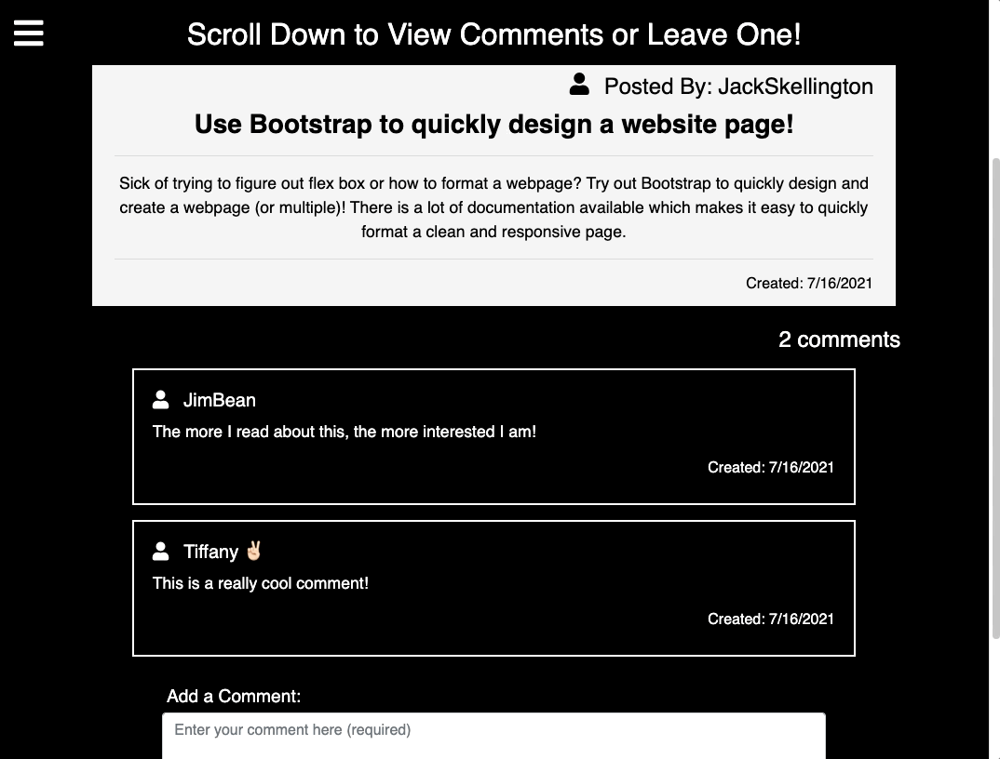
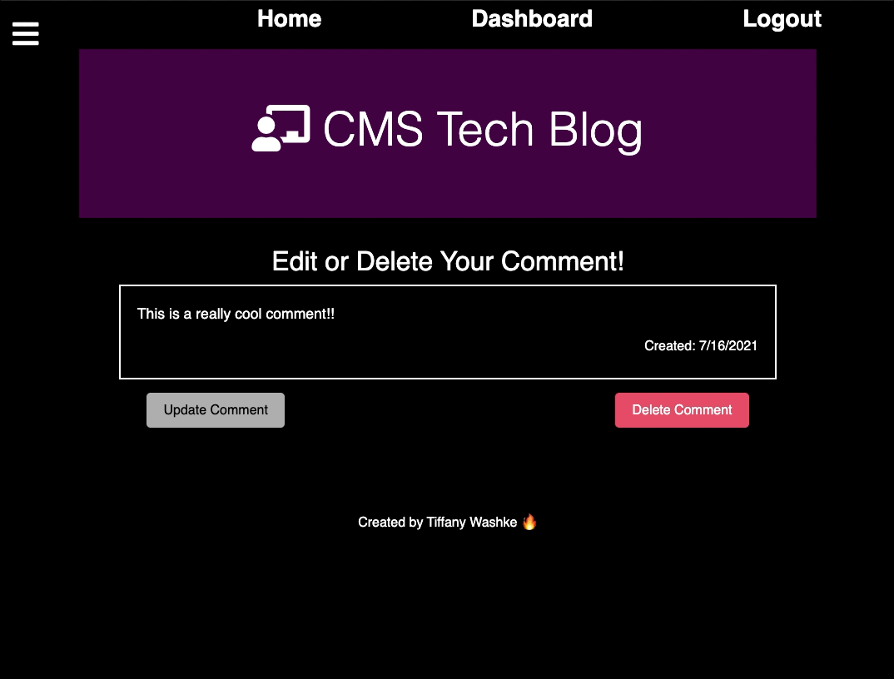
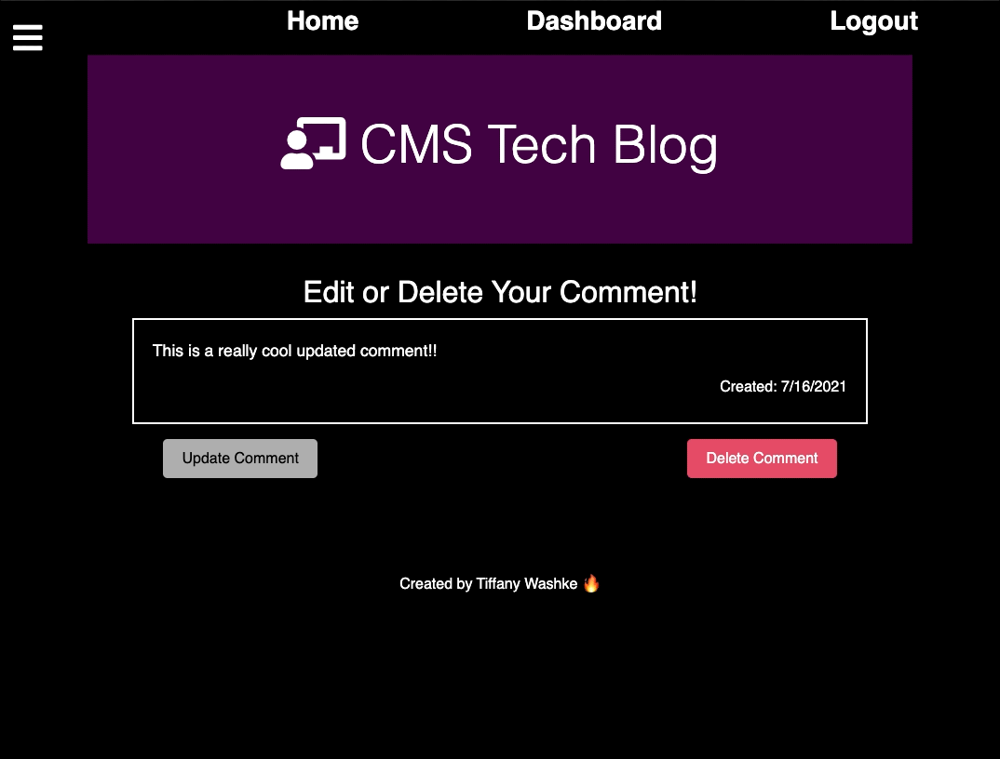

# MVC Tech Blog

 

## Description

The [CMS Tech Blog](https://techblogmvc072021.herokuapp.com/) was created to allow users the ability to post about technology and receive comments from other users. The **Home** page shows all posts ordered by date (most recent at the top) with the number of comments for each post. If the user is not logged in they will not be able to view, or add any comments. After **Sign Up** or **Login** the user can post on their **Dashboard**. From here they are also able to edit or delete any posts they have created. On the **Home** page the user can click on the post title or (comments under post) to view the comments, or add comments. Any comments posted can only be edited or deleted by the user that created the comment. By clicking on the username in the **comments** section, the user can update or delete their own comments (if not the user, they will not be able to access the comment). Once the user is done, they can use **Logout** to end their session.

## Table of Contents

- [About the Project](#about-the-project)
- [Installation](#installation)
- [Usage](#usage)
- [Contributing](#contributing)
- [Tests](#tests)
- [License](#license)
- [Questions](#questions)

## About the Project

- The **Home** page allows all users access to all posts ordered by date created (most recent at the top).
- The number of comments is shown below the post (this will link to the individual post and all comments, but can't be accessed until after login).
- Using the **Login** tab (or if the user tries to go to any restricted page) a returning user can **Login** or a new user can **Sign Up**.
- Once logged in the user can access their own **Dashboard** that allows them to add their own posts.
- Once posts have been added, they can be updated or deleted through the **Dashboard** tab.
- After the user is logged in, the **Home** page allows them to access the comments by clicking on the title of the post, or the comments section below it.
- This will give the user access to that post and all comments connected to it. By scrolling down they can view the comments or add their own.
- A user can update or delete their own comment by clicking on their user name on the comment. From here they can update or delete their comment. Please note: if not the user, they will not have access to that comment.
- Once the user is done, they can **Logout** of their session.
- This application was designed to be **Mobile Friendly**
- Created using MVC ([Model-view-controller](https://en.wikipedia.org/wiki/Model%E2%80%93view%E2%80%93controller))
- Built with the following technologies:
  - [nodemon](https://www.npmjs.com/package/nodemon)
  - [path](https://www.npmjs.com/package/path)
  - [express](https://www.npmjs.com/package/express)
  - [express-session](https://www.npmjs.com/package/express-session)
  - [express-handlebars](https://www.npmjs.com/package/express-handlebars)
  - [mysql2](https://www.npmjs.com/package/mysql2)
  - [dotenv](https://www.npmjs.com/package/dotenv)
  - [bcrypt](https://www.npmjs.com/package/bcrypt)
  - [sequelize](https://www.npmjs.com/package/sequelize)
  - [connect-session-sequelize](https://www.npmjs.com/package/connect-session-sequelize)
  - [HTML](https://www.w3schools.com/html/), [CSS](https://www.w3.org/Style/CSS/Overview.en.html), and [Javascript](https://www.javascript.com/)
  - [Bootstrap](https://getbootstrap.com/)
  - [Font Awesome](https://fontawesome.com/)

## Installation

- Open [CMS Tech Blog](https://github.com/twashke/Tech-Blog)
- Use the command line to **git clone**
- **npm install**
- Copy [.envEXAMPLE](.env.EXAMPLE) and paste to create an **.env** file to include MySql for access to the database and the picture database.
- Copy [Database](/db/schema.sql) and drop in local [MySql Workbench](https://www.mysql.com/products/workbench/).
- **node run seeds/seeds.js** to drop seeds in command line.
- **npm start** from command line to connect server.
- Go to [localhost:3001](http://localhost:3001/) in Web Browser to view.

## Usage

- [Deployed **CMS Tech Blog**](https://techblogmvc072021.herokuapp.com/).
- The **Home** page shows all current posts with number of comments below (until logged in users can't access the comments).
- Use the **Login** tab to **Sign Up** (or **Loging**).
- For **Login** email and password and for **Sign Up** username, email and password.
- The user is directed to their personal **Dashboard** where they can create new posts or edit (update or delete) posts they have created.
- To view other user posts, return to the **Home** page.
- To **comment** on a post click the title of the post or the comments below the post to access the individual post and all associated comments.
- Scroll down to view comments or add a new comment.
- A user can edit (update or delete) their own comment by clicking on their username on the comment (if they are not the user nothing will happen).
- The user who entered the comment can **Update** or **Delete** their comment.
- Once a user is done they can **Logout** to end their session.

[CMS Tech Blog](https://techblogmvc072021.herokuapp.com/) **Home** page and **Login**
 \
\
**Login** to [CMS Tech Blog](https://techblogmvc072021.herokuapp.com/)
 \
\
Add Post on **Dashboard**
 \
\
Edit Post on **Dashboard**
 \
\
Delete Post on **Dashboard**
 \
\
Access to Comments Once Logged In
 \
\
Add a Comment to a Post
 \
\
User Can Access Comments to Edit
 \
\
Update Your Own Comment
 \
\
Delete Your Own Comment
 \
\
**Logout** Access Denied After

## Contributing

- No contributions were made to this project.

## Tests

- Testing in both local and live environment to ensure everything is working properly.

## License

This application is covered by the [MIT License](https://opensource.org/licenses/MIT).

      Copyright 2021 Tiffany Washke

      Permission is hereby granted, free of charge, to any person obtaining a copy of this software and associated documentation files (the "Software"), to deal in the Software without restriction, including without limitation the rights to use, copy, modify, merge, publish, distribute, sublicense, and/or sell copies of the Software, and to permit persons to whom the Software is furnished to do so, subject to the following conditions:

      The above copyright notice and this permission notice shall be included in all copies or substantial portions of the Software.

      THE SOFTWARE IS PROVIDED "AS IS", WITHOUT WARRANTY OF ANY KIND, EXPRESS OR IMPLIED, INCLUDING BUT NOT LIMITED TO THE WARRANTIES OF MERCHANTABILITY, FITNESS FOR A PARTICULAR PURPOSE AND NONINFRINGEMENT. IN NO EVENT SHALL THE AUTHORS OR COPYRIGHT HOLDERS BE LIABLE FOR ANY CLAIM, DAMAGES OR OTHER LIABILITY, WHETHER IN AN ACTION OF CONTRACT, TORT OR OTHERWISE, ARISING FROM, OUT OF OR IN CONNECTION WITH THE SOFTWARE OR THE USE OR OTHER DEALINGS IN THE SOFTWARE.

## Questions

**Contact Tiffany Washke**

- **Email directly at** twashke@gmail.com
- **GitHub User Name:** [twashke](https://github.com/twashke)

